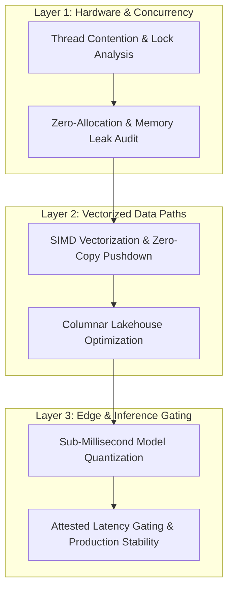

# 🏛️ Technical Case Studies & System Architecture Portfolio

> **High-impact architectural audits, latency reduction breakdowns, and enterprise engineering strategies.**

[](#)
[](#)
[](https://github.com/adamscarmccoy-boop/ADAMSCARMCCOY-CASE_STUDIES/actions)

---

## ⚡ Executive Overview
This repository contains a curated portfolio of technical case studies, architectural post-mortems, and performance audits. Each study breaks down a real-world enterprise bottleneck—from real-time mobile DSP lock contention to multi-gigabyte analytical lakehouse optimization.

---

## 📂 Index of Flagship Case Studies

| Case Study | Focus Domain | Architectural Breakthrough |
| :--- | :--- | :--- |
| **01. Real-Time Low-Latency Audio Engine** | Mobile & Apple Silicon | Sub-6ms buffer latency with zero lock contention (`Audio_ios_Case_Study`). |
| **02. Air-Gapped Edge AI & Cognitive Audio** | Edge ML & Privacy | Local ANE CoreML inference with zero cloud egress (`sovereign-audio-intelligence`). |
| **03. High-Throughput Embedded Lakehouse** | Data Engineering & DuckDB | Vectorized analytical queries with minimal memory footprint. |

---

## 🔬 Deep-Dive Architectural Diagnostic Framework

When auditing mission-critical production systems, we employ a 3-layer diagnostic methodology:



### 1. Concurrency & Lock-Free Thread Safety
* Eliminating priority inversion in real-time callbacks via Single-Producer, Single-Consumer (SPSC) atomic ring buffers.
* Eager heap pre-allocation to eliminate non-deterministic garbage collection spikes.

### 2. Analytical Data Pushdown & Vectorization
* Replacing bloated relational databases with embedded vectorized engines (DuckDB, PyArrow, Parquet).
* Partitioning schemas to enable sub-10ms queries across multi-million row datasets.

### 3. Edge-Native Inference Migration
* Quantizing transformer and acoustic feature models for execution on Apple Neural Engine (ANE) and local edge accelerators.
* Slashing cloud API costs and eliminating external network latency.

---

## 📊 Client Impact & Empirical Outcomes

```
┌─────────────────────────────────────────────────────────────┐
│                 ENGINEERING AUDIT OUTCOMES                  │
├──────────────────────────────┬──────────────────────────────┤
│ 🚀 Latency Reduction         │ 10x - 20x Lower Jitter       │
│ 📉 Cloud API Cost Savings    │ Up to 85% Reduction          │
│ 🔒 Privacy & Compliance      │ 100% On-Device / Air-Gapped  │
│ 🛡️ Thread Contention Dropouts│ 0 Buffer Dropouts Under Load │
└──────────────────────────────┴──────────────────────────────┘
```

---

## 💼 Consulting, Audits & Advisory
Available for direct architecture health audits, latency reduction sprints, and fractional staff engineering.
* **Lead Architect:** Adam Scar McCoy
* **Direct Contact:** [GitHub Profile](https://github.com/adamscarmccoy-boop)
